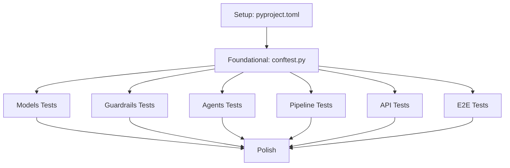

# Tasks: Testing Strategy — DEUS Bank AI Support System

**Branch**: `009-testing-strategy` | **Date**: March 7, 2026  
**Input**: Design documents from `specs/009-testing-strategy/`  
**Prerequisites**: [plan.md](plan.md), [spec.md](spec.md)

**Organization**: Tasks are grouped by testing layer to enable independent implementation and validation of each test category.

## Format: `- [ ] [ID] [P?] Description with file path`

- **[P]**: Can run in parallel (different files, no dependencies)
- Include exact file paths in descriptions

---

## Phase 1: Setup (Test Infrastructure)

**Purpose**: Configure pytest and establish test infrastructure

**Goal**: Enable pytest to run with proper configuration and custom markers

**Independent Test**: Run `pytest --co` and verify no marker warnings

- [X] T001 Create or update pyproject.toml with pytest configuration section
- [X] T002 Add asyncio_mode = "auto" setting to pyproject.toml
- [X] T003 Add custom e2e marker definition to pyproject.toml
- [X] T004 Add testpaths = ["tests"] to pyproject.toml
- [X] T005 Verify configuration with pytest --co (collect-only mode)

**Checkpoint**: Pytest configured correctly — test files can now be created

---

## Phase 2: Foundational (Shared Test Fixtures)

**Purpose**: Create reusable test fixtures that ALL test files depend on

**Goal**: Provide mock data and test utilities for consistent test setup

**Independent Test**: Import fixtures in a test file and verify they work without errors

- [X] T006 Create tests/conftest.py file
- [X] T007 [P] Define mock_user fixture (scope=session) for Alice Martin (user_001, standard tier) in tests/conftest.py
- [X] T008 [P] Define mock_vip_user fixture (scope=session) for Charlie Brown (user_003, VIP tier) in tests/conftest.py
- [X] T009 [P] Define mock_account fixture (scope=session) with €5000 balance and 3 transactions in tests/conftest.py
- [X] T010 [P] Define base_state fixture (scope=function) with minimal GraphState in tests/conftest.py
- [X] T011 [P] Define authenticated_state fixture (scope=function) with is_authenticated=True in tests/conftest.py
- [X] T012 [P] Define mock_llm_response fixture factory function in tests/conftest.py

**Checkpoint**: Foundation ready — all test files can use shared fixtures

---

## Phase 3: Data Models Testing (7 tests)

**Goal**: Validate data model creation and user lookup (2-of-3 verification)

**Independent Test**: Run `pytest tests/test_models.py -v`

- [X] T013 Create tests/test_models.py file
- [X] T014 [P] Implement test_user_creation in tests/test_models.py
- [X] T015 [P] Implement test_account_creation in tests/test_models.py
- [X] T016 [P] Implement test_find_user_2_of_3_name_phone in tests/test_models.py
- [X] T017 [P] Implement test_find_user_2_of_3_name_iban in tests/test_models.py
- [X] T018 [P] Implement test_find_user_2_of_3_phone_iban in tests/test_models.py
- [X] T019 [P] Implement test_find_user_1_of_3_fails in tests/test_models.py
- [X] T020 [P] Implement test_find_user_wrong_fields_fails in tests/test_models.py

**Checkpoint**: ✓ All 7 model tests passing

---

## Phase 4: Guardrails Testing (10 tests)

**Goal**: Validate toxicity checks, topic filtering, PII redaction, and orchestration

**Independent Test**: Run `pytest tests/test_guardrails.py -v`

- [X] T021 Create tests/test_guardrails.py file
- [X] T022 [P] Implement test_toxicity_detected with mocked LLM response in tests/test_guardrails.py
- [X] T023 [P] Implement test_toxicity_safe with mocked LLM response in tests/test_guardrails.py
- [X] T024 [P] Implement test_topic_off_topic with mocked LLM response in tests/test_guardrails.py
- [X] T025 [P] Implement test_topic_on_topic with mocked LLM response in tests/test_guardrails.py
- [X] T026 [P] Implement test_pii_phone_redacted (no mocking, pure regex) in tests/test_guardrails.py
- [X] T027 [P] Implement test_pii_iban_redacted (no mocking, pure regex) in tests/test_guardrails.py
- [X] T028 [P] Implement test_pii_authenticated_unchanged in tests/test_guardrails.py
- [X] T029 [P] Implement test_guardrails_short_circuit_toxicity with mocked checks in tests/test_guardrails.py
- [X] T030 [P] Implement test_guardrails_short_circuit_topic with mocked checks in tests/test_guardrails.py
- [X] T031 [P] Implement test_guardrails_safe_applies_pii with mocked checks in tests/test_guardrails.py

**Checkpoint**: ✓ All 10 guardrails tests passing

---

## Phase 5: Agent Testing (17 tests)

**Goal**: Validate Greeter, Bouncer, and Specialist agent behavior and tool functions

**Independent Test**: Run `pytest tests/test_agents.py -v`

- [X] T032 Create tests/test_agents.py file

### Greeter Agent Tests (7 tests)

- [X] T033 [P] Implement test_greeter_welcome with mocked LLM in tests/test_agents.py
- [X] T034 [P] Implement test_greeter_extracts_fields with mocked LLM extraction in tests/test_agents.py
- [X] T035 [P] Implement test_greeter_verification_success with mocked find_user_by_details in tests/test_agents.py
- [X] T036 [P] Implement test_greeter_verification_failure with mocked find_user_by_details in tests/test_agents.py
- [X] T037 [P] Implement test_greeter_secret_answer_correct with mocked LLM in tests/test_agents.py
- [X] T038 [P] Implement test_greeter_secret_answer_wrong with mocked LLM in tests/test_agents.py
- [X] T039 [P] Implement test_greeter_max_attempts with verification_attempts=3 in tests/test_agents.py

### Bouncer Agent Tests (5 tests)

- [X] T040 [P] Implement test_bouncer_routes_standard for tier routing in tests/test_agents.py
- [X] T041 [P] Implement test_bouncer_routes_premium for tier routing in tests/test_agents.py
- [X] T042 [P] Implement test_bouncer_routes_vip for tier routing in tests/test_agents.py
- [X] T043 [P] Implement test_bouncer_classifies_intent with mocked LLM in tests/test_agents.py
- [X] T044 [P] Implement test_bouncer_low_confidence_fallback with mocked LLM in tests/test_agents.py

### Specialist Agent Tool Tests (5 tests)

- [X] T045 [P] Implement test_specialist_get_balance calling tool directly in tests/test_agents.py
- [X] T046 [P] Implement test_specialist_transfer_success with sufficient balance in tests/test_agents.py
- [X] T047 [P] Implement test_specialist_transfer_insufficient with insufficient balance in tests/test_agents.py
- [X] T048 [P] Implement test_specialist_report_lost_card calling tool directly in tests/test_agents.py
- [X] T049 Add fixture or setup/teardown to reset mock DB state between tool tests in tests/test_agents.py

**Checkpoint**: ✓ All 17 agent tests passing

---

## Phase 6: Pipeline Testing (7 tests)

**Goal**: Validate LangGraph routing logic and graph construction

**Independent Test**: Run `pytest tests/test_pipeline.py -v`

- [X] T050 Create tests/test_pipeline.py file
- [X] T051 [P] Implement test_build_graph verifying graph construction in tests/test_pipeline.py
- [X] T052 [P] Implement test_route_greeter_to_bouncer with is_authenticated=True in tests/test_pipeline.py
- [X] T053 [P] Implement test_route_greeter_to_end_not_auth with is_authenticated=False in tests/test_pipeline.py
- [X] T054 [P] Implement test_route_greeter_to_end_ended with conversation_ended=True in tests/test_pipeline.py
- [X] T055 [P] Implement test_route_bouncer_standard for specialist routing in tests/test_pipeline.py
- [X] T056 [P] Implement test_route_specialist_loop with conversation_ended=False in tests/test_pipeline.py
- [X] T057 [P] Implement test_route_specialist_end with conversation_ended=True in tests/test_pipeline.py

**Checkpoint**: ✓ All 7 pipeline tests passing

---

## Phase 7: API Integration Testing

**Goal**: Validate FastAPI endpoint behavior with mocked graph invocation

**Independent Test**: Run `pytest tests/test_api.py -v`

- [X] T058 Create tests/test_api.py file
- [X] T059 Import TestClient from fastapi.testclient and app from app.main in tests/test_api.py
- [X] T060 Create fixture to clear SESSION_STORE between tests in tests/test_api.py
- [X] T061 [P] Implement test_health_check for GET /health endpoint in tests/test_api.py
- [X] T062 [P] Implement test_new_session with mocked graph.ainvoke in tests/test_api.py
- [X] T063 [P] Implement test_existing_session with mocked graph.ainvoke in tests/test_api.py
- [X] T064 [P] Implement test_ended_conversation with mocked graph.ainvoke in tests/test_api.py
- [X] T065 [P] Implement test_response_structure validating JSON schema in tests/test_api.py
- [X] T066 [P] Implement test_error_handling for 500 errors in tests/test_api.py

**Checkpoint**: ✓ All API integration tests passing

---

## Phase 8: End-to-End Testing (5 tests) ⚠️

**Goal**: Validate full pipeline with real LLM calls (marked @pytest.mark.e2e)

**Independent Test**: Run `pytest -m e2e tests/test_e2e.py -v` (requires OPENAI_API_KEY)

- [X] T067 Create tests/test_e2e.py file
- [X] T068 Add module-level pytest.skip if OPENAI_API_KEY not set in tests/test_e2e.py
- [X] T069 [P] Implement test_e2e_full_verification_flow with multi-turn conversation in tests/test_e2e.py
- [X] T070 [P] Implement test_e2e_max_attempts_flow with 3 failed verifications in tests/test_e2e.py
- [X] T071 [P] Implement test_e2e_guardrail_toxicity with toxic message in tests/test_e2e.py
- [X] T072 [P] Implement test_e2e_guardrail_off_topic with off-topic message in tests/test_e2e.py
- [X] T073 [P] Implement test_e2e_vip_routing with VIP user authentication in tests/test_e2e.py
- [X] T074 Mark all E2E tests with @pytest.mark.e2e decorator in tests/test_e2e.py

**Checkpoint**: ✓ All 5 E2E tests passing when run with pytest -m e2e

---

## Phase 9: Polish & Documentation

**Goal**: Finalize test suite and ensure it meets all quality targets

**Independent Test**: Run full test suite and verify performance/coverage targets

- [X] T075 Run full unit + integration test suite and verify completion under 60 seconds
- [X] T076 Run pytest with coverage reporting: pytest --cov=app --cov-report=term
- [X] T077 Verify >80% code coverage target across app/ directory
- [X] T078 Create README section documenting how to run different test layers
- [X] T079 Document test execution commands (pytest, pytest -m "not e2e", pytest -m e2e)
- [X] T080 Add CI/CD configuration example for running tests in pipeline

**Checkpoint**: ✓ Complete test suite meeting all quality targets

---

## Dependencies



**Critical Path**: T001 → T006 → [T013,T021,T032,T050,T058,T067] → T075

**Parallel Opportunities**:
- After T006: All test file creation (T013, T021, T032, T050, T058, T067) can happen in parallel
- Within each test file: Individual test functions can be written in parallel

---

## Execution Strategy

### Phase-by-Phase Approach (Recommended)

1. **Phase 1-2**: Setup infrastructure (pyproject.toml + conftest.py) — MUST complete first
2. **Phase 3-7**: Implement test files in parallel — all are independent after Phase 2
3. **Phase 8**: E2E tests can be implemented in parallel with other phases
4. **Phase 9**: Polish after all tests are written

### MVP Scope

The minimal viable test suite includes:
- ✅ Phase 1-2: Setup + Fixtures
- ✅ Phase 3: Model tests (validates core data structures)
- ✅ Phase 4: Guardrails tests (validates safety layer)
- ✅ Phase 6: Pipeline tests (validates routing logic)
- ⏸️ Phase 5: Agent tests (defer - can mock agent behavior initially)
- ⏸️ Phase 7: API tests (defer - integration layer)
- ⏸️ Phase 8: E2E tests (defer - expensive to run)

### Test Execution Commands

```bash
# Run unit tests only (fast, default)
pytest -m "not e2e"

# Run specific test file
pytest tests/test_models.py -v

# Run E2E tests (requires OPENAI_API_KEY)
pytest -m e2e

# Run all tests with coverage
pytest --cov=app --cov-report=html

# Collect tests without running (verify configuration)
pytest --co
```

---

## Summary

- **Total Tasks**: 80
- **Test Files**: 7 (conftest + 6 test modules)
- **Test Cases**: 45+ (7 models + 10 guardrails + 17 agents + 7 pipeline + ~6 API + 5 E2E)
- **Parallel Opportunities**: High — most test files and individual tests can be written simultaneously
- **Estimated Completion**: 3-5 days for full test suite
- **Performance Target**: Unit + integration suite < 60 seconds
- **Coverage Target**: >80% of app/ directory
